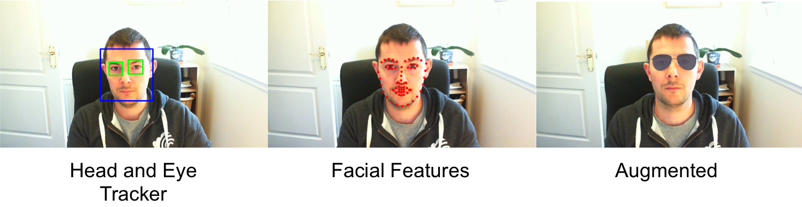

### Augmented Reality: Face Detection

Augmented reality (AR) is a technology that superimposes computer-generated images on a view of the real world. Unlike virtual reality (VR) which requires the user to inhabit a fully virtual world, AR augments (enhances) the existing environment.

This short project explores face detection and adding filters over detected regions.

#### Launching a new Environment
The following command will launch an environment with the relevant dependencies:
```
conda env create -f environment.yml -n aug_face
```
Once created the new environment can be activated and deactivated using the following commands:
```
source activate aug_face
pip install opencv-python==3.3.0.10
pip install opencv-contrib-python==3.3.0.10
```
The final command will launch a new intsance of iPython Notebooks in the environment:
```
jupyter notebook
```
To close or remove the environment (after deactivation) run the following:
```
source deactivate
conda env remove -n aug_face
```

#### Analysis

Most of this project is repurposed code to demonstrate what can be achieved through use of OpenCV. The Harrcascades and Facial Recognition files are too large to include in the repo but can be obtained online. The following image demonstrates a simple head and eye tracker, a more sophisticated facial recognition system and finally an Augmented Reality filter applied over facial features.
<p align="center">

</p>